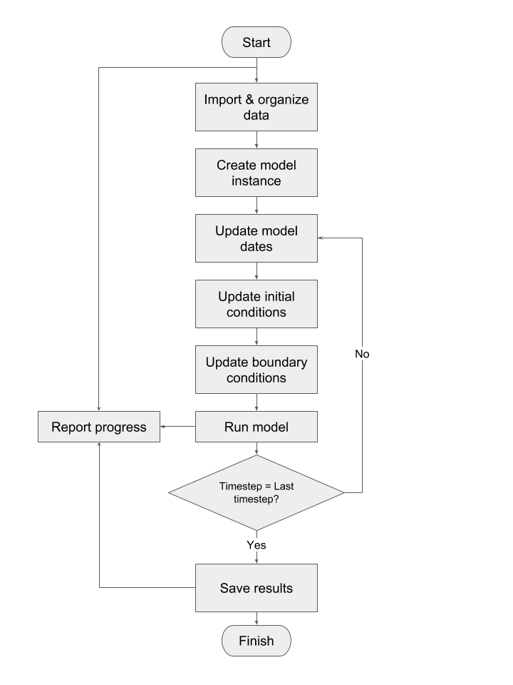

# WaterLP

WaterLP is the default generalized water system model integrated into OpenAgua. This integration, though optional, allows you to start modeling water system right away. As with that for OpenAgua generally, this documentation is currently under construction.

See also the [code repository for WaterLP](https://github.com/openagua/waterlp-pywr).

Here is a high level flow chart of the modeling steps:

