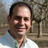

# the-team

OpenAgua is developed and maintained by a core group of university researchers and funding partners, with development and technical support from many others.

## Institutional Partners

[**UMass Hydrosystems Research Group**](http://blogs.umass.edu/hydrosystems/about/)**, University of Massachusetts Amherst.**

[**Center for Water for Latin America and the Caribbean**](http://www.centrodelagua.org/)**, Tecnológico de Monterrey.**

[**Center for Watershed Sciences**](https://watershed.ucdavis.edu/)**, University of California, Davis.**

## Core Team

In alphabetical order:

 [**Casey Brown, PhD, Hydrosystems Research Group, University of Massachusetts Amherst**](https://cee.umass.edu/faculty/casey-brown). Dr. Brown helps guide the vision of OpenAgua and helps ensure its continued short-term development in the context of multiple high profile water systems.

 **Laura Elisa-Garza, M.S., Center for Water for Latin America and the Caribbean, Tecnológico de Monterrey**. Laura is leading the study to demonstrate OpenAgua for the city of Monterrey, Mexico, develops content \(e.g., documentation\) and visual design, and continually tests OpenAgua.

 [**Josué Medellín-Azuara, Ph.D.**](https://watershed.ucdavis.edu/people/joshmd)**, Senior Researcher, Center for Watershed Sciences, University of California, Davis**. Dr. Medellín-Azuara is the U.S. co-Principal Investigator for the CITRIS-funded seed project to develop OpenAgua, helping to oversee project organization and coordinate with other related projects.

 [**Aldo Ramírez-Orozco, Ph.D.**](http://www.centrodelagua.org/draldo.aspx)**, Professor, Center for Water for Latin America and the Caribbean, and General Director, Núcleo Estrategico de Decisiones \(NED\), at Tecnológico de Monterrey**. Dr. Ramírez is the Mexico co-Principal Investigator for the CITRIS-funded seed project to develop OpenAgua, helping to guide project organization and liaising with funding partners in Mexico.

 **David Rheinheimer, Ph.D., Post-doctoral Researcher, Hydrosystems Group, University of Massachusetts Amherst**. Dr. Rheinheimer conceptualized OpenAgua and is involved in all aspects of its development, including vision, strategic planning, project management and technical leadership; to-date, he has been the primary developer of OpenAgua. His primary interests are in developing and leveraging decision support technologies to improve strategic management of water and energy resources.

 [**Michael Zarozinski**](https://www.cics.umass.edu/people/zarozinski-michael)**, Senior Software Engineer, College of Information and Computer Sciences, University of Massachusetts Amherst**. He is a lead designer and implementer of the "heart and soul" of OpenAgua, the facility to run and monitor models. Michael is interested in all aspects of artificial intelligence and the art and science of software engineering.

In addition, core development is in close collaboration with others. In particular:

**Stephen Knox, Ph.D., Lead Developer, Water Resources Group, Manchester University**. Dr. Knox is the lead developer of [Hydra Platform](http://hydraplatform.org/), the core data organization framework and web server used by OpenAgua. Steve provides critical support for Hydra Platform and advice on strategic development.

## Funding Partners

The OpenAgua team appreciates working with our initial funding partners, for both their financial support and strategic vision.

[**CITRIS and the Banatao Institute**](http://citris-uc.org/)**, University of California**. CITRIS provided the seed funding for OpenAgua in 2016 under the 2016 joint CITRIS-ITESM seed funding program. Under this program, "Bi-national research teams in Mexico and California develop promising, early-stage IT projects that can attract larger funding and support resources." See the [anouncement of the award](http://citris-uc.org/three-california-mexico-research-teams-win-seed-funds-from-citris-itesm/).

[**FEMSA Foundation**](http://www.femsa.com/en/femsa-foundation). The FEMSA Foundation supports the Núcleo Estrategico de Decisiones \(Nucleus for Strategic Decisions, or NED\) at the Water Center for Latin America at Tecnológico de Monterrey, under which OpenAgua was initiated.

[**Inter-American Development Bank \(IADB\)**](http://www.iadb.org/). IADB also supports NED.

**Tecnológico de Monterrey**. Tecnológico de Monterrey also supports NED, including with physical space.

## Translation Team

Translations \(forthcoming\) are provided by a dedicated, enthusiastic, and uncompensated, team of already-overworked graduate students or recent graduates. They will be acknowledged once the multilingual capability is fully implemented.

## The Open Source Community

OpenAgua uses primarily Open Source software, much of which is highly undervalued by society, yet nonetheless otherwise extremely appreciated. We consider the many thuosands of developers who have contributed to the various technologies used by OpenAgua to be implicitly part of the team. See the list of [core technologies](https://github.com/openagua/openagua-documentation/tree/f19ba5dcd6e831142525f48888c806f2925f6afe/README.md#core-technologies).

